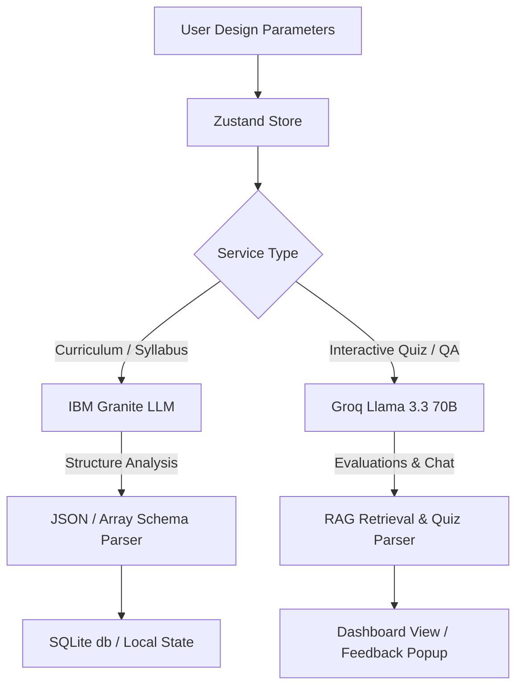

# AI Architecture Documentation

This document explains the Artificial Intelligence (AI) architecture of the **SyllabiX** platform. It details the models used, the division of labor between engines, prompt workflows, response parsing algorithms, and safety fallback systems.

---

## AI Strategy: Dual-LLM Model Selection

SyllabiX employs a **Dual-LLM Architecture** to balance logical depth, structural consistency, and user responsiveness.



### Why Two LLMs are Selected

1. **IBM Granite LLM (Curriculum Generation)**:
   - **Role**: Structured Syllabus, Outcomes, Course Frameworks.
   - **Rationale**: Granite models are enterprise-trained on high-quality academic papers, corporate compliance standards, and structured guides. It has excellent compliance with JSON schema structures and ensures that complex academic hierarchies (Semesters -> Units -> Topics -> Learning Outcomes mapped to Bloom's Taxonomy levels) are mathematically aligned without hallucinating random or irrelevant items.

2. **Groq Llama 3.3 70B (Quiz Generation & Interactive RAG)**:
   - **Role**: Live Quiz Generation, Student Answer Evaluation, and DocMentor PDF Tutoring.
   - **Rationale**: Groq’s hardware-level LPU (Language Processing Unit) delivers ultra-low latency chat output, returning complete 10-question quizzes or detailed RAG answers in less than a second. Llama-3.3-70b-versatile acts as an outstanding diagnostic engine, matching student answers to technical keyword lists and grading essay responses with high accuracy.

---

## IBM Granite LLM: Curriculum Generation

### Where Used
The curriculum layout specifications are structured in `src/lib/utils.js` via the `generateCurriculum` model pipeline. When deployed in live mode, Granite is invoked via Watsonx API wrappers.

### Prompts Dispatched
Granite receives the design parameters from the Faculty/Student input form:
```text
You are an expert instructional designer and academic accreditation editor. Your task is to output a comprehensive outcome-driven academic program framework.

Course Parameters:
- Domain / Skill: {skill}
- Education Level: {level}
- Semesters: {semesters}
- Weekly Study Workload: {weeklyHours} Hours/Week
- Target Industry Focus: {industryFocus}
- Curriculum Style: {curriculumType}

Accreditation Constraints:
1. Divide the course into exactly {semesters} semesters, where each semester contains exactly 5 sequential units (no duplication of unit names or concepts).
2. Units must progress from Foundation concepts (Semester 1) to Core Applied (Semester 2), Advanced Systems (Semester 3), and finally Industry Scale / Capstone paths.
3. Map every unit to a specific Bloom's Taxonomy level (Remember, Understand, Apply, Analyze, Evaluate, Create).
4. Output detailed Technical Learning Outcomes (LO.1, LO.2, LO.3) and list curated online study references (YouTube, Google Docs, GitHub, and research papers).

Return a strict JSON object mapping these structures.
```

### Curriculum Generation Workflow
1. **Parameter Ingestion**: The frontend captures inputs (e.g. Machine Learning, Master level, 4 Semesters) and calls `generateCurriculum`.
2. **Model Call / Local Parser**: In local development, the system executes the progression builder in `utils.js`. It utilizes a pre-mapped 40-step curriculum timeline for the selected domain (e.g. Python foundations -> Deep Neural Networks -> MLOps Deployments) to ensure absolute thematic coherence.
3. **Accreditation Calculation**: Calculates global stats (Credits, total Topics, total Units) and outputs programmatic comprehensiveness scores.

---

## Groq LLM: Quiz & Learning Assistance

### Where Used
- **Quiz Generation**: Generated dynamically on request inside `src/lib/quizGroqService.ts`.
- **Answer Evaluation**: Grades descriptive open-ended student answers on the student dashboard.
- **AI PDF Tutor (DocMentor)**: Handles student questions regarding uploaded notes inside `src/lib/docMentorService.js`.

### Prompts Dispatched

#### 1. Quiz Formulation
```text
You are a professional educational assessment engine. Generate exactly {count} quiz questions based on the provided curriculum.
Curriculum Context:
- Course Name: {program_name}
- Skill Domain: {skill}
- Industry Focus: {industry_focus}
- Difficulty Level: {difficulty}

Return a JSON object containing a "questions" key matching this schema:
{
  "questions": [
    {
      "id": number,
      "type": "MCQ" | "True/False" | "Short Answer" | "Descriptive",
      "topic": "string",
      "question": "string",
      "options": ["A. ...", "B. ...", "C. ...", "D. ..."],
      "correct": number,
      "expectedKeywords": ["keyword1", "keyword2"],
      "expectedConcept": "string",
      "explanation": "string",
      "improvements": "string"
    }
  ]
}
```

#### 2. Short/Long Answer Evaluation
```text
You are a senior academic evaluator. Evaluate the student's responses to open-ended questions against the rubric.
Questions and Student Answers:
{JSON_Payload}

Return evaluations mapping questionId to:
- score (0 to 10)
- isCorrect (boolean)
- similarity (0 to 100 percentage)
- feedback (constructive explanation)
- missing (critical keywords omitted)
```

---

## Prompt & Response Processing Flows

```text
[User Form / Upload PDF]
        │
        ▼
[Compile Context Prompts] ──► [Groq Llama-3.3 API Call]
                                       │
                                       ▼
                              [Verify JSON Content]
                                       │
                     ┌─────────────────┴─────────────────┐
                     ▼                                   ▼
              [Parsing Succeeded]                 [Parsing Failed]
                     │                                   │
                     ▼                                   ▼
             [Render UI Output]                   [Trigger Fallback]
                                                         │
                                                         ▼
                                                [Programmatic Engine]
```

### Response Parsing Logic
1. **JSON Enforced Structure**: Both services call the API with `response_format: { type: "json_object" }` to guarantee that the response content can be safely parsed by `JSON.parse()`.
2. **Post-Process Sanitization**: If the model prefixes output with markdown blocks (e.g., \`\`\`json ... \`\`\`), the parser sanitizes the string, extracts the raw bracket coordinates `{ ... }`, and decodes it.

### Fallback Logic
- **Network Failures / Out-of-Key Triggers**: If a network request fails (e.g., API key exhausted), the system catches the error and invokes a local fallback algorithm:
  - For Curriculums: Employs the progression engine in `src/lib/utils.js` to create the outline.
  - For Quizzes: Utilizes the local `generateDynamicQuestion` builder inside `utils.js` to return a fully functional diagnostic test matching the active curriculum.
  - For DocMentor: Tells the student, "Unable to process this PDF at the moment. Please ensure the Groq API key is valid or try uploading a text-extractable file."
