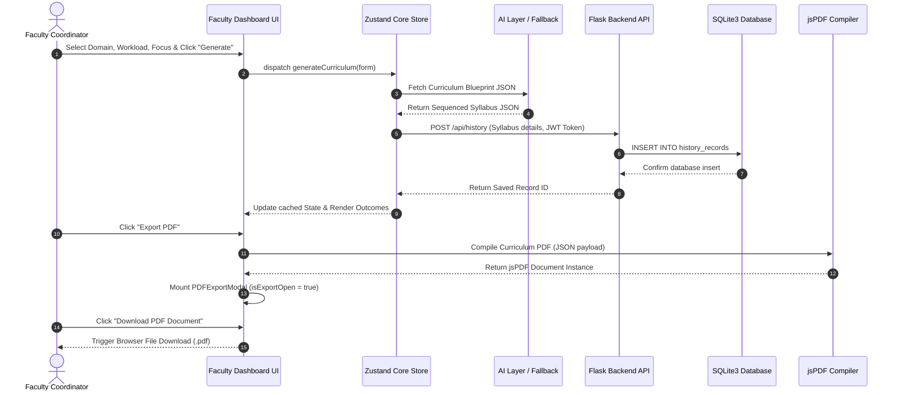

# Data Flow Documentation

This document explains the data lifecycle of **SyllabiX** from user action to frontend routing, database updates, AI compilation, and PDF rendering.

---

## Complete System Data Flow Path

Below is the logical data flow progression:

```text
[User UI Action] ──► [Zustand Client Store] ──► [Local / API Services]
                                                        │
                                                        ▼
                                                 [AI Layer Engines]
                                                - Granite (Curriculum)
                                                - Groq (Quizzes, RAG)
                                                        │
                                                        ▼
                                              [Flask Server Endpoint]
                                                        │
                                                        ▼
                                             [SQLite Database Commit]
                                                        │
                                                        ▼
                                              [Client jsPDF Engine]
                                                        │
                                                        ▼
                                              [Download PDF / Output]
```

---

## Detailed Step-by-Step Data Flow

### 1. User Action
- **Faculty Curriculum Generation**: A user enters design parameters (Course Name, Duration, Hours/Week, Target Focus, Level) on `FacultyDashboard.jsx` and clicks **Generate**.
- **Student Quiz Attempt**: A student selects a generated curriculum, launches **Practice Quizzes**, inputs answers to MCQs and open-ended text fields, and clicks **Submit**.
- **Student Upload Notes**: A student selects a PDF document and uploads it inside `DocMentor.jsx`.

### 2. Frontend State Processing
- State fields are collected and validated inside parent React components.
- The component dispatches actions to the Zustand core state store (`src/store/index.js` or `authStore.js`).
- The store updates loading indicators (`loading = true`), triggering spinner animations.

### 3. AI Service Layer Execution
- Depending on the active task, the request is routed to the corresponding service:
  - **Curriculum Generation**: Dispatches prompts to the IBM Granite LLM (or falls back to the local programmatic compiler in `src/lib/utils.js` if keys are missing) to construct a sequenced multi-semester curriculum object containing topics, outcomes, projects, and reference resources.
  - **Quiz Generation**: Calls `generateQuizFromGroq` inside `quizGroqService.ts` utilizing `llama-3.3-70b-versatile` to return structured assessments.
  - **DocMentor Chat Retrieval (RAG)**: The custom parser extracts PDF text streams, segments pages into contextual chunks, filters search tokens via local TF-IDF, finds top matches, constructs local context templates, and routes the query to Groq for answering.

### 4. Persistence Layer Execution
- The frontend calls the API client (`src/lib/api.js`) passing the payload.
- The Flask backend catches the request:
  - Validates the incoming JWT identity header.
  - Inserts curriculum metadata and the serialized data string into SQLite `history_records`.
  - Commits the transaction and returns the record ID.
- The client-side Zustand store appends the record to `historyList` and caches the data in memory.

### 5. PDF Generation Pipeline
- The user clicks **Export PDF**.
- The frontend retrieves the curriculum object from the cache and calls `downloadCurriculumPDF(curriculum)`.
- The compiler constructs a new `jsPDF` instance, draws cover sheets, metadata boxes, semester headings, unit tables, and clickable blue URLs.
- The generator returns `{ doc, filename }` to the frontend.

### 6. UI Output Rendering
- The parent template intercepts the compiled PDF object, opens `PDFExportModal`, and displays a confirmation dialog.
- The user clicks **Download PDF Document**, triggering `doc.save()` to download the file locally.

---

## Sequence Interaction Diagram

The diagram below details the sequential interactions during curriculum generation:


