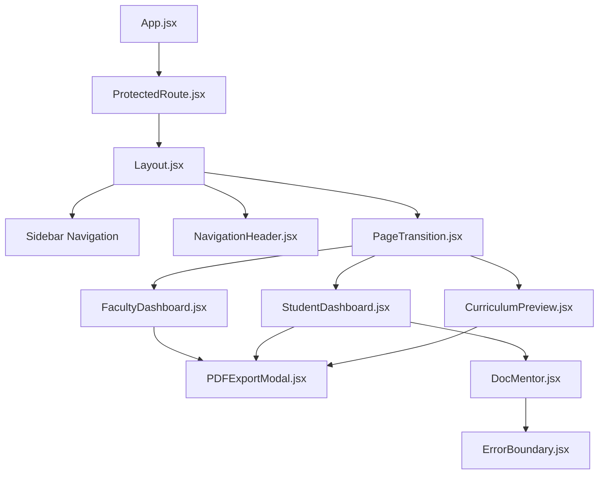

# complete Codebase Architecture Document

This document details the frontend architecture, component layout, data communication models, routing structure, and state management paradigms of the **SyllabiX** application.

---

## Frontend Architecture

The SyllabiX frontend is a React SPA constructed using Vite. The directory structure is organized as follows under `src/`:

### 1. Folder Inventory & Purpose

#### `src/pages/`
* **Purpose**: Page components mapped directly to specific URL routes. They capture page-level layout, fetch data from Zustand stores or APIs, and coordinate user actions.
* **Key Files**:
  - `HomePage.jsx`: The landing page for public users detailing features and entry actions.
  - `About.jsx`: Features product descriptions, pricing mocks, and detailed background graphics.
  - `Generate.jsx`: Entrance workspace selector (Faculty vs Student).
  - `FacultyDashboard.jsx`: Contains the curriculum generator wizard, outcomes tables, quality scoreboard, and practice quiz builder.
  - `StudentDashboard.jsx`: Contains study path selectors, study planners (milestones checklist), practice assessments (quizzes with immediate AI responses), and gamified badge stats.
  - `CurriculumPreview.jsx`: Deep outcome-oriented preview of the generated handbook.
  - `SemesterView.jsx`: Detail outline of semester units, milestones, and unit cards.
  - `CourseDetail.jsx`: Explores specific competencies and lecture tracks.
  - `UnitDetail.jsx`: Detail view of topics, video references, GitHub code repositories, and research papers.
  - `History.jsx`: List of past generations with reload and delete options.
  - `Settings.jsx`: Theme customizations and model temperature presets.
  - `Profile.jsx`: User profile updating forms and data backup handlers (JSON download).
  - `auth/`: Login, Signup, ForgotPassword, and ResetPassword forms.

#### `src/components/`
* **Purpose**: Reusable modular UI elements that accept properties and execute focused functionalities.
* **Key Files**:
  - `Layout.jsx`: Master page framework with sticky sidebar, active dropdowns, and responsive panels.
  - `NavigationHeader.jsx`: Top navigation sub-navbar containing the browser Back button and role-aware Home button.
  - `PDFExportModal.jsx`: Confirmation modal to download generated documents as PDF or close the wizard.
  - `DocMentor.jsx`: Advanced learning assistant interface managing file uploads, local indexing, semantic RAG query submissions, and formatted markdown response rendering.
  - `PremiumBackground.jsx` & `AboutBackground.jsx`: Performance-tuned CSS particle canvas loops and mesh styling layers.
  - `NeuralCursor.jsx`: Reactive pointer animation matching user inputs.
  - `ErrorBoundary.jsx`: React component catching sub-component failures without crashing the page.
  - `ProtectedRoute.jsx`: Redirects unauthenticated users to `/login`.
  - `UserAvatar.jsx`: Renders profile pictures or fallback letter initials.
  - `ScrollToTop.jsx`: Triggers window scrolls on navigate.

#### `src/hooks/`
* **Purpose**: Custom React hooks encapsulation.
* **Key Files**:
  - `useGoogleAuth.js`: Coordinates Firebase Google Sign-In popups, captures profile data, and dispatches credential validation to the Flask API.

#### `src/store/`
* **Purpose**: Centralized reactive state stores built with Zustand.
* **Key Files**:
  - `authStore.js`: Manages user credentials, authentication state, login/registration API triggers, and local storage token caching.
  - `index.js` (Core Store): Coordinates curriculum outlines, active roles (`faculty` / `student`), generation configurations, loading states, history logs, and profile statistics.

#### `src/lib/`
* **Purpose**: Non-UI service classes, network clients, helper algorithms, and exporter blocks.
* **Key Files**:
  - `api.js`: Network client utilizing standard fetch wrappers with credentials and JWT bearer headers.
  - `pdfGenerator.js`: Outlines-driven handbook compiler utilizing jsPDF layout coordinates.
  - `docMentorService.js`: Dynamic script injector for PDF.js, text parser, local TF-IDF semantic query retrieval, and Groq integration for the PDF Tutor.
  - `quizGroqService.ts`: Groq question generator and Technical keyword evaluator.
  - `utils.js`: Core curriculum outline builder, Bloom's tag mapping, and mock grading utilities.

---

## Component Hierarchy & Relationships

The diagram below details how data and layout elements are composed inside protected sections:

---

## State Management (Zustand)

SyllabiX manages state reactively using Zustand. It features two primary stores:

### 1. `authStore.js`
- **Managed State**:
  - `user`: Authenticated user profile information (email, name, role, photo_url, phone, etc.).
  - `loading`: Async network state indicator.
  - `error`: Authentication error feedback strings.
- **Key Methods**:
  - `login(email, password)`: Dispatches credentials to backend, saves JWT access/refresh tokens in localStorage, and sets the `user` profile.
  - `googleLogin(profile)`: Sends Google OAuth credentials to backend.
  - `logout()`: Clears local storage and resets profile states.
  - `fetchProfile()`: Reloads user details on boot.

### 2. `index.js` (Core Store)
- **Managed State**:
  - `currentRole`: Active workspace context (`faculty` or `student`).
  - `facultyCurriculumData` / `studentCurriculumData`: Currently loaded curriculum objects.
  - `loading`: Global compilation loader flag.
  - `historyList`: Loaded list of past blueprints from the database.
  - `selectedHistoryRecord`: Active history element in memory.
  - `modelTemp` / `modelPreset`: AI generation preferences.
- **Key Methods**:
  - `generateCurriculum(params)`: Triggers local builder utilities and saves syllabus records to backend history.
  - `loadHistory(role)`: Syncs user dashboard history logs.
  - `deleteHistory(id)`: Removes records.

---

## Data Flow & Communications

Pages and sub-components communicate via **Shared Stores** and **Passed Callback Props**:

1. **State Synchronizations**: When a user updates their profile image in `Profile.jsx`, they invoke `useAuthStore.getState().setUser(...)`. The changed user state immediately triggers reactive updates on elements like `UserAvatar.jsx` and `Layout.jsx` sidebar details.
2. **Curriculum Creation Flow**:
   - `FacultyDashboard.jsx` collects user inputs.
   - Triggers `generateCurriculum` in core store.
   - Curriculums are generated, saved via `api.js` to `/api/history`, and cached in the Zustand store.
   - Client navigates to `/curriculum`. `CurriculumPreview.jsx` reads `facultyCurriculumData` from the store and renders the statistics panels.
3. **Modal Interactions**:
   - The export modal `<PDFExportModal />` is rendered conditionally inside parent pages (`{isExportOpen && <PDFExportModal ... />}`).
   - Parents pass down `pendingPDF` data and an `onClose` callback to reset the parent's `isExportOpen` state.

---

## Navigation & Routing

Navigation is controlled via **React Router DOM v7** inside `App.jsx`:
- **Public Routes**: `/login`, `/signup`, `/forgot-password`, `/reset-password`, `/about`, and `/` (Home landing page).
- **Protected Layout Routes**: Wrapped in `ProtectedRoute` and `Layout.jsx`.
  - `/dashboard`: High level landing panel.
  - `/generate`: Portal workspace selector.
  - `/faculty` / `/student`: Active workspace dashboards.
  - `/curriculum`: Handbook viewer.
  - `/settings` & `/profile`: Management sections.
- **Navigation Controls**: The reusable `NavigationHeader.jsx` handles custom page navigation:
  - **Back Button**: Invokes `window.history.back()` if navigation history is active.
  - **Home Button**: Resolves back to `/faculty` or `/student` depending on the current role.
